```mermaid
classDiagram

    IEnumerable~T~ <|-- IEnumerableNonGeneric : implements
    ICollection~T~ <|-- IEnumerable~T~ : implements
    IList~T~ <|-- ICollection~T~ : implements
    List~T~ <|-- IList~T~ : implements
    
    ICollectionNonGeneric <|-- IEnumerableNonGeneric : implements
    IListNonGeneric <|-- ICollectionNonGeneric : implements
    List~T~ <|-- IListNonGeneric : implements
    
    IReadOnlyCollection~T~ <|-- IEnumerable~T~ : implements
    List~T~ <|-- IReadOnlyCollection~T~ : implements
    
    IReadOnlyList~T~ <|-- IReadOnlyCollection~T~ : implements
    List~T~ <|-- IReadOnlyList~T~ : implements

    class List~T~{ }
    class ICollection~T~
    <<interface>> ICollection~T~
    class IEnumerable~T~
    <<interface>> IEnumerable~out T~
    class IEnumerableNonGeneric
    <<interface>> IEnumerableNonGeneric
    class IList~T~
    <<interface>> IList~T~
    class IReadOnlyCollection~T~
    <<interface>> IReadOnlyCollection~T~
    class IReadOnlyList~T~
    <<interface>> IReadOnlyList~T~
    class IList
    <<interface>> IList
    class ICollectionNonGeneric
    <<interface>> ICollectionNonGeneric
    class IListNonGeneric
    <<interface>> IListNonGeneric

```

# Array data structure

This one is a note for my studies in computer science. It does not mean to be extremely
precise. If you look for scientific precision in every details, see the references at the
bottom.

Array is a data structure where elements are stored in a memory and the memory addresses of the
values are known. Known means that the occupied memory can be contiguous or not, but the memory
addresses of the values are computable. This fact makes possible that reading, overwriting and
adding an element to a certain place in the array is O(1).

There are sources where the array is a data structure where the data is stored in the memory
sequentially. It means the same as the previous section, but doesn't clarify that the point of
the array is that the value memory addresses are known/computable.

The size of the array is always fixed. Possibly this fix size makes possible that the memory
addresses of the values are computable. If you need a bigger array you have to create a new one
with the desired size and copy the old one into it.

Worth to check which language offers contiguous implementation of array, and which makes
possible to choose between a contiguous and a non-contiguous implementations.

If we know the memory addresses of the values, then we can access to the list via an iterator?

# Operations

| Operation          | O notation      |
|--------------------|-----------------|
| Add                | O(1) - constant |
| Delete             | O(1) - constant |
| Search or traverse | O(n) - linear   |
| Update             | O(1) - constant |

## Add

### O(1)

Array add function adds a new element to the end of the array. The picture below shows a 32 bit
system where we have an integer array. A single value occupies 4 bytes.

- the array is 10 element length
- it already have 4 values added
- the remaining values are filled with default value (in case of integer it is `0`)
- the place of the next value is marked `yellow`

## Delete

### O(1)

Array delete function removes an item from the array, and the place in the array will be set to
default value.

## Search or traverse through

### O(n)

Array search or traverse function goes through the array until it finds the desired element. In
worst case the desired element either not in the array or it is the last one. In this case the
all the elements are touched by the operation. As the size of the array grows the amount of
required operations grow.

## Update

## O(1)

Array update overwrites the marked element with another value.

## Insert

## O(n)

Array insert function inserts the given value into the array and all of the items behind it
will be shifted back by 1.

# Dynamic versus static arrays

## Dynamic array

Dynamic array is when the size of the array can change, and it is managed automatically, so the
programmer doesn't have to pay attention to it. It comes with the occasionally `O(n)`
operation. It is due to that when the inner array, which is fixed size, reaches its size limit
the content has to be copied to a bigger array. How the size of the array increases depends on
implementation by implementation.

In C# there is
the [ArrayList](https://docs.microsoft.com/en-us/dotnet/api/system.collections.arraylist?view=net-6.0)
and [List< T>](https://docs.microsoft.com/en-us/dotnet/api/system.collections.generic.list-1?view=net-6.0)
datatype providing dynamic arrays.

## Static array

In case static arrays the size of the array must be managed by the programmer.

# C\# implementation

- c\# has the array data structure which is marked with `[]`
- c\# provides dynamic array data structures
  like [ArrayList](https://docs.microsoft.com/en-us/dotnet/api/system.collections.arraylist?view=net-6.0)
  and [List< T>](https://docs.microsoft.com/en-us/dotnet/api/system.collections.generic.list-1?view=net-6.0)
- it can store data from the same type `int[]` or any type then it is `object[]`
- the data structure has size, but it is inferred at creation
  like `var arr = new int[] {1, 2, 3};`
- or can be specified `var arr = new int[5]`

## ArrayList

- It implements the
  non-generic [IList](https://docs.microsoft.com/en-us/dotnet/api/system.collections.ilist?view=net-6.0)
  interface
- the internal array size is managed automatically
- this data type has
  an [internal non-generic array](https://github.com/dotnet/runtime/blob/a2448b024022d54d279ae18ab7b587bc50023a63/src/libraries/System.Private.CoreLib/src/System/Collections/ArrayList.cs#L31)
  to store data
- it means that all the values added to this datatype will be casted to object and back, it is
  called [autoboxing](https://docs.microsoft.com/en-us/dotnet/csharp/programming-guide/types/boxing-and-unboxing)
  which requires CPU
- this is the reason behind that
  [Microsoft doesn't recommend using ArrayList at all](https://docs.microsoft.com/en-us/dotnet/api/system.collections.arraylist?view=net-6.0#remarks)
  .

## List< T>

- it represents a strongly typed array for storing data
- it uses
  a [strongly typed array](https://github.com/dotnet/runtime/blob/a2448b024022d54d279ae18ab7b587bc50023a63/src/libraries/System.Private.CoreLib/src/System/Collections/Generic/List.cs#L25)
  internally to store data
- the strongly typed array removes boxing from the picture so `List<T>` performs better
  than `ArrayList`
- if `T` is value type then the compiler generates implementation specifically for the type,
  the extra overhead coming with this are gained back when the list is longer than 500 elements
  by not boxing them

## When to use Array and List< T>?

- when the size of the array doesn't change you can use `T[]`
- when the size is going to change use `List<T>`
- when you have to store multiple data type in the same list then use either `object[]`
  or `ArrayList` if the size of the array changes
- `List<T>` and `[]` offers the same services, the difference is that `List<T>` manages the size too

# References

- [Array data structure](https://en.wikipedia.org/wiki/Array_data_structure)

Class diagram of `Array` type.

Class diagram of `ArrayList` type:

Class diagram of `IList<T>` type:

