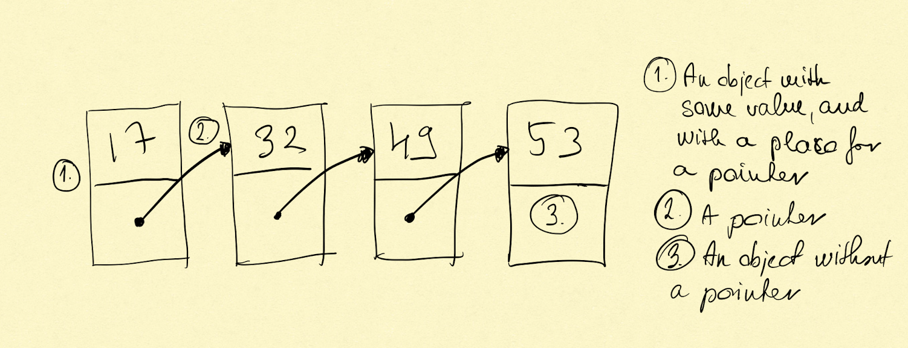
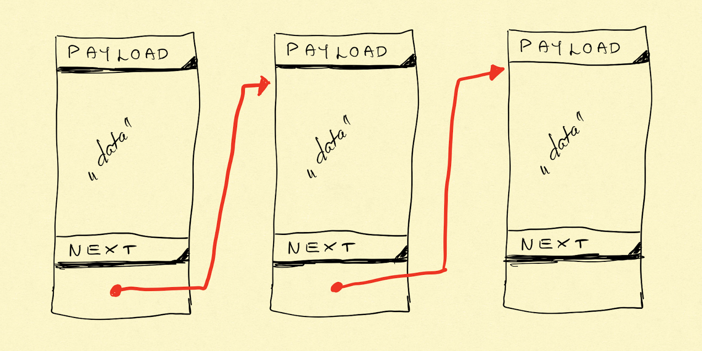

# Linked list

Linked list is a linear collection of data elements whose order is not given by their physical placement in memory.
Instead, each element points to the next. It is a data structure consisting of a collection of nodes which together
represent a sequence. In its most basic form, each node contains: data, and a reference (in other words a link), to the
next node in the sequence. This structure allows for efficient insertion or removal of elements of elements in any
position in the sequence during iteration. More complex variants add additional links, allowing more efficient insertion
or removal of nodes at arbitrary positions. A drawback of linked list is that access time is linear and difficult to
pipeline. Faster access, such as random access, is not feasible. Array has better cache locality compared to linked
lists.

Linked lists are among the simplest and most common data structures. They can be used to implement several other common
abstract data types, including lists, stacks, queues, associative arrays, and S-expressions, though it is not uncommon
to implement those data structures directly without using linked list as the basis.

The principal benefit of a linked list over a conventional array is that the list elements can be easily inserted or
removed without reallocation or reorganization of the entire structure because the data items need to be stored
contiguously in memory or in disk, while restructuring an array at run-time is a much more expensive operation. Linked
lists allow insertion and removal of nodes at any point in the list, and allow doing so with a constant number of
operations by keeping the link previous to the link being added or removed in memory during list traversal.

On the other hand, since simple linked list by themselves do not allow random access to data or any form of efficient
indexing, many basic operations - such as obtaining last node of the list, finding node that contains a given datum, or
locating the place where the new node should be inserted - may require iterating through most or all of the list items.
The advantages and disadvantages of using linked list are given below. Linked list are dynamic, so the length of the
list can increase or decrease as necessary. Each node does not necessary follows the previous one physically in the
memory.

# History

For history of linked list go the official Wikipedia article [here](https://en.wikipedia.org/wiki/Linked_list)

## Disadvantages

- The use more memory than arrays because of the storage used by their pointers
- Nodes in a linked list must be read in order from the beginning as linked lists are inherently sequential access
- Nodes are stored noncontiguously, greatly increasing the time periods required to access individual elements within
  the list, especially with a CPU cache

- Difficulties arise in linked lists when it comes to reverse traversing. For instance, singly-linked lists are
  cumbersome to navigate backward, and while double-linked lists are somewhat easier to read, memory is consumed in
  allocating space for a back pointer.

## Basic concepts and nomenclature

- Each record of a linked list is often called and \'element\' or \'node\'.
- The field of each node that contains the address of the next node is usually called the \'next linke\' or \'next
  pointer\'. The remaining remaining fields are known as \'data\'., \'information\', \'cargo\', \'value\', or
  \'payload\'.

- The \'head\' of a list is its first node. The \'tail\' of a list may refer either to the rest of the list after the
  head, or to the last node in the list. In Lisp and some derived languages, the next node may be called the \'cdr\' (
  pronounced could-er) of the list, while the payload of the head node may be called the \'car\'.

## Operations

### Insertion

Insertion happen when the linked list gets a new node, where the node can be the head, can be the tail, and can be
inserted into the line of nodes.

### Deletion

Deletion happen when a node is getting removed from the line of nodes, where the removed node can be the head, the tail
or any item between the two.

### Traversal

Traversal happens when, for example during search, a program goes through the line of nodes one by one. This is the way
to find a certain node in the line of nodes.

# Variations

## Singly linked list

Singly linked lists contain nodes which have a data field as well as \'next\' field, which points to the next node in
the line of nodes. Operations that can be performed on singly linked lists include insertion, deletion and traversal.

### Disadvantages

- traversing backward on a singly linked list is difficult

- Doubly linked list
- Multiply linked list
- Circular linked list
- Sentinel nodes
- Empty lists
- Hash linking
- List handles

# Links

- [Linked list article on Wikipedia](https://en.wikipedia.org/wiki/Linked_list)
