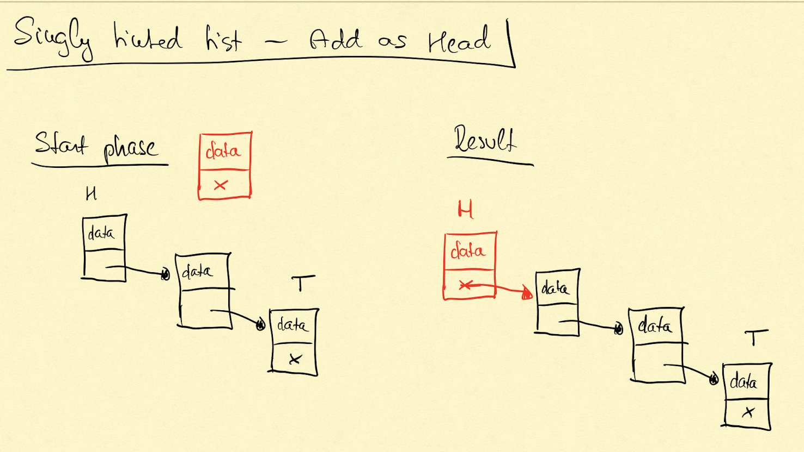

# Singly Linked List Design

The purpose of this design is pure practice.

Linked list is a data structure which consists of objects. An object has information about which other, same type,
object is the next in the line because every object has a field, called \'next\', containing a reference for the next
item in the line.

## Naming

- the node which is in the first place called \'head\'
- the node which is the last in the line called \'tail\'
- the data contained by nodes called \'data\'

## Object

- has a \'data\' field which may contain any type, and may be null or empty
- has a \'next\' field which has the data about the next object in the line, it may be null and implementation dependent
  whether it is a pointer or something else

## Operations

### Insertion

#### Add as Head

Adds a new item as Head, if there is an existing head, then the old head will be the second int he line and be
referenced as \'next\' at the new Head. If the Head is registered somewhere then that value also will be updated.

Returns void.

Error handling:

- if object input is null throws exception
- any error happens throws exception

#### Add as Tail

Adds a new Tail to the list. If there is an already existing Tail then the new one will be referenced at the old as
\'next\'. If the Tail is registered somewhere then that value also will be updated.

Returns void.

Error handling:

- if object input is null throws
- if any error happens throws

#### Add after

Adds a node after the defined node. If the defined node already has \'next\', then that connection will be removed, and
the added node added as \'next\', and the old connection added to the newly added one as \'next\'.

Returns void.

Error handling:

- if object input is null throws
- if any error happens throws

#### Add before

Adds a node before the defined node. The connection between the defined node and the previous to it will be removed. The
previous node's next node will be the one we provide as parameter, the defined before will be next to the newly added one.

Returns void.

Error handling:

- if object input is null throws
- if any error happens throws

### Deletion

- Delete head
- Delete tail
- Delete any item
- Delete After
- Clear the list

### Search

- Find head
- Find tail
- Find any item
- Contains where we would like to have the information whether given node/data is part of the linked list or not

### Conversion

- Convert to simply array or list
- Convert to HashMap or Dictionary (C\#)