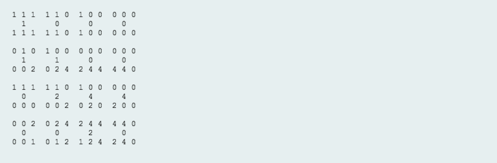

# 2D Array Data Structure

url: https://www.hackerrank.com/challenges/2d-array/problem

Given 6x6 2D array, called `arr`.

```
1 1 1 0 0 0
0 1 0 0 0 0
1 1 1 0 0 0
0 0 0 0 0 0
0 0 0 0 0 0
0 0 0 0 0 0
```

An hourglass in `A` is a subset of values with indices falling in this pattern in `arr`'s graphical
representation.

```
a b c
  d
e f g
```

There are 16 hourglasses in `arr`. An hourglass sum is the sum of an hourglass' values. Calculate the
hourglass sum for every hourglass in `arr`, then print the maximum hourglass sum. The array will alwyas
be `6x6`.

**Example**:
```
-9 -9 -9  1 1 1 
 0 -9  0  4 3 2
-9 -9 -9  1 2 3
 0  0  8  6 6 0
 0  0  0 -2 0 0
 0  0  1  2 4 0
```

The 16 hourglass sums are:
```
-63, -34, -9, 12, 
-10,   0, 28, 23, 
-27, -11, -2, 10, 
  9,  17, 25, 18
```

The highest hourglass sum is `28` from the hourglass beginning row 1, column 2:
```
0 4 3
  1
8 6 6
```

**Function description**:
`hourglassSum` method has the following parameters:

- int `[6][6]`: an array of integers

Returns:

- int: the maximum hourglass sum

Input format:
Each of the 6 lines of inputs `arr[i]` contains 6 space separated integers `arr[j][k]`

Constraints:
- -9 ≤ arr[j][k] ≤ 9
- 0 ≤ j,k ≤ 5

Output format:
Print the largest maximum hourglass sum found in `arr`.

Sample input:
```
1 1 1 0 0 0
0 1 0 0 0 0
1 1 1 0 0 0
0 0 2 4 4 0
0 0 0 2 0 0
0 0 1 2 4 0
```

Sample output:
`19`

Explanation:
`arr` contains the following hourglasses:



The hourglass with the maximum sum(19) is:
```
2 4 4
  2
1 2 4
```

